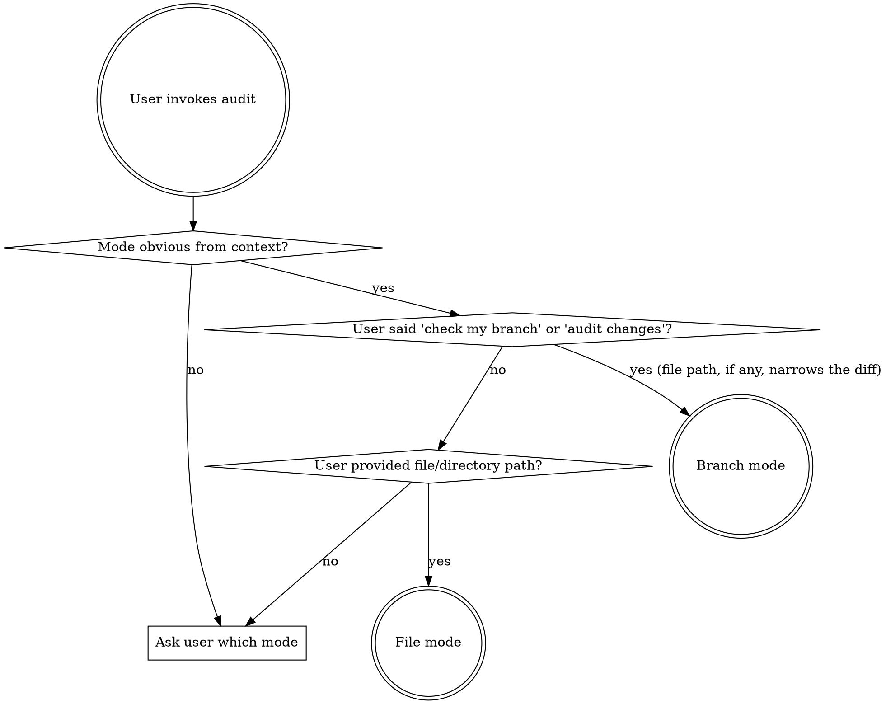

# Review Mode Options

Two modes: **branch mode** (audit only changed code) and **file mode** (audit full files).

## Mode Selection



## Branch Mode

1. Determine the base branch:

```bash

git symbolic-ref refs/remotes/origin/HEAD 2>/dev/null | sed 's|refs/remotes/origin/||'

```

Use the result if available; fall back to `main` if the command fails or returns nothing. The user may always override. Note the base branch used at the top of the report.

2. Get changed component and style files — use three-dot notation (merge-base to `HEAD`) so unrelated commits that have landed on `<base-branch>` since the branch diverged don't show up as "changes":

```bash

git diff <base-branch>...HEAD --name-only -- '*.tsx' '*.jsx' '*.js' '*.css' '*.scss' '*.html'

```

Criteria such as contrast (1.4.3), focus-visible (2.4.7), reduced motion (2.3), target size (2.5.8), and text resize (1.4.4) live mostly in `.css`/`.scss` files — without these globs the audit structurally cannot see the code those criteria govern. The `.html` glob covers the document shell (`public/index.html`), where `<html lang>` (3.1.1) and the page `<title>` (2.4.2) live in non-Next apps.

For each matched `.js` file, grep it for a JSX marker (e.g. a `return (` followed by `<`, or a capitalized JSX tag) before auditing — plain `.js` config, utility, or server files without JSX produce false-positive findings if audited as components.

If the result is empty, stop and confirm with the user: "No JSX/TSX/JS/CSS files were changed relative to `<base-branch>`. Did you mean to audit specific files instead? I can switch to file mode if you provide a path." Do not produce a report or merge readiness verdict for an empty diff.

3. For each changed file, get the diff, also using the merge-base:

```bash

git diff <base-branch>...HEAD -- <file>

```

4. Also **Read** the full file for context (you need surrounding code to judge landmarks, heading hierarchy, etc.)

5. Audit **only changed/added lines**. Do NOT flag pre-existing issues unless they directly interact with new code (e.g., new input added to a form that already lacks a fieldset).

6. In findings, tag each issue:

- **Introduced**: issue exists only in the new/changed code

- **Pre-existing (affects new code)**: old issue that interacts with the diff

## File Mode

1. If given a directory, glob for `**/*.tsx`, `**/*.jsx`, `**/*.js`, `**/*.css`, `**/*.scss`, and `**/*.html`

2. For each matched `.js` file, grep it for a JSX marker before including it in the audit — plain `.js` config, utility, or server files without JSX produce false-positive findings if audited as components

3. Read each file

4. Audit full contents — report all findings

**Note:** when styling is Tailwind classes, CSS custom properties, styled-components/CSS-in-JS, or design-token files, values aren't directly readable from source and static analysis can't compute contrast/spacing — flag the limitation and recommend the Level Access scan or Colour Contrast Analyser instead of guessing (see `POUR.md`'s static-analysis-limitation note).
