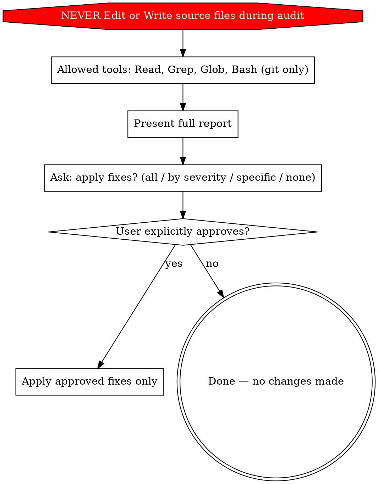

# Read-Only Enforcement

Audit phase is **100% read-only**. No source files may be modified until the user explicitly approves changes after seeing the full report.

## Red Flags — STOP Immediately

If you catch yourself doing ANY of the following during the audit phase, you are violating the skill:

- Using the **Edit** tool on any source file

- Using the **Write** tool on any source file

- "Fixing" issues as you find them

- Applying changes without presenting the report first

- Applying changes without the user saying "yes"
